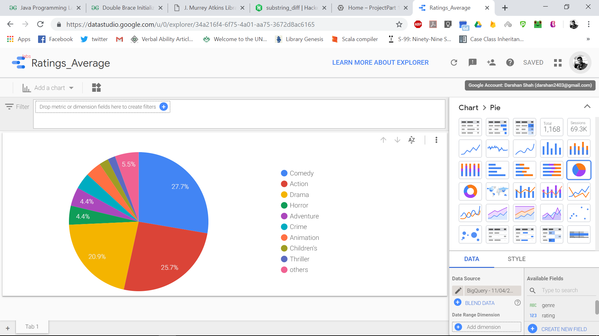
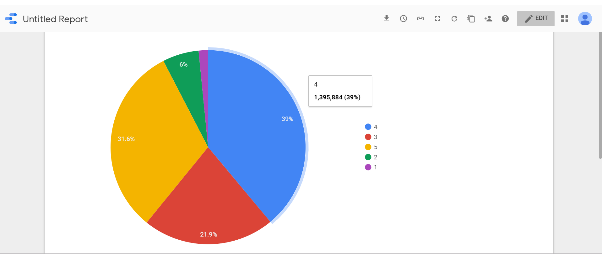

# MovieMania - Movie Recommender System on the Google Cloud Platform 
### Project Background 

We have targeted a movie recommendation engine which would recommend movies to users, based on the ratings provided by other users. 

**Recommendation systems** play an integral role for e-commerce websites and service providers like online streaming services (Netflix, Prime Video, etc) and many others. Amazon is perhaps one of the most recognizable companies using  a recommendation engine to generate income daily (*recognize the “People who bought this also bought these items” feature?*). Another popular example is Netflix, which recommends movies based on user's historic preferences and similar users' ratings. 


# How MovieMania Works 

## Collaborative Filtering in TensorFlow using WALS

Our system implements a collaborative filtering recommendation model using the WALS
(weighted alternating least squares) algorithm provided in TensorFlow to apply
it on the MovieLens dataset.

### Setting up the Environment 

This code assumes python version 2.7.

* Install miniconda2 

https://conda.io/docs/user-guide/install/index.html


* Create a new environment and install packages 

Assuming you are in the repo directory, run: 

```
$ conda create -n tfrec
$ conda install -n tfrec --file requirements.txt
```

* Install TensorFlow 

CPU:
```
$ pip install tensorflow
```

Or GPU, if one is available in your environment:

```
$ pip install tensorflow-gpu
```


### Downloading Movielens Data

```
$ curl -O 'http://files.grouplens.org/datasets/movielens/ml-100k.zip'
$ unzip ml-100k.zip
$ mkdir data
$ cp ml-100k/u.data data/
```

### Running the Model 

*   Train the model locally
```
$ ./mltrain.sh local data/u.data
```

*   Train the model on ML Engine:
```
$ gsutil cp data/u.data gs://mybucket/data/u.data
$ ./mltrain.sh train gs://mybucket/data/u.data
```

*   Hyperparameter tuning on ML Engine:
```
$ ./mltrain.sh tune gs://mybucket/data/u.data
``` 

*** 

### Research question: Which genre are acclaimed among MovieLens users?

As this is a recommendation system, it is important for entertaintment websites to know what genre are users more inclined towards, this will help the system suggesting movies based on that. Doing this we concluded that comdey is the highly rated genre and that can be initially reccomended to new users of the system, who have currently joined and there is no significant data for that users.


### Domain & Data

We have used a dataset of 1.13 GB released by grouplens from MovieLens website. The dataset contains 27,000,000 (27 million) anonymous ratings of approximately 58,000 movies made by 280,000 MovieLens users.

Dataset represents users and movies with unique integer ids. In all the files in dataset, data is separated by delimeter '::'. Ratings given by users are from scale 1 to 5, 5 being the highest rating.

Following are the files and more metadata on the data files: 

* **Movies.dat** 
    * ___Fields___: **movieId**, **title** (has **year** appended at the end for most movies), **genre** (pipe delimited for additional genres). 
    * 58,000 plus movie records. 
* **Ratings.dat**
    * ___Fields___: **userId**, **movieId**, **rating** (0-5, 0.5 increments), **timestamp** (long integer), **personalized_rating.txt** (which contains all ratings by a particular user for whom we want to recommend movies). 
    * 27 million plus user ratings (for all the movies combined). 
    
#### Preprocessed Data 

As the dataset was very structured and clean, minimal preprocessing was needed to prepare the data for machine learning. All the python code for preprocessing can be found in ***[preprocessData.ipynb](https://github.com/shahkush18/knowledge-based-systems/blob/master/preprocessData.ipynb)***. The final dataset can also be found in the **`data/`** folder above. In brief, following steps were taken for preprocessing: 

* Movie year was split from its title => **year column was added to movies.csv** 
* As many movies belong to more than one genre, we created two datasets from movies.csv: 
  * **movies_genre_columns** (or) **movies_final.csv**: In this file, we split all the genres of each movie and put it in its own column. So, for example, we have ***genre_1, genre_2, genre_3***, ... so on till ***genre_10***. As this resulted in a very sparse matrix and it was hard to calculate frequency of genre in the dataset, we created the following file. 
  
  
  
  * **movies_genre_rows.csv**: In this file, we added a record the movies table for every genre it belongs to. So, we had two records for the movie if it belongs to two genres, five records if it belongs to five genres, and so on. 
  
  

### Tentative plan for analysis on GCP 

</br>
<ol>
 <li>  EDA and Preprocessing : Data has been already pre processed. We can directly work on it and implement the recommendation algorithm.</li></br>
 <li>Dashboard for User group, Dashboard for Data Engineers : We will plan to represent graphically the genres which are most recommended to a particular user. Also dashboards for the user to watch a movie if has likes the movie of same genre.</li></br>
 <li>GCP further processing - ML : We will use ALS(Alternative Least Square) algorithm which is Collaborative filtering algorithm built in Apache MLlib.</li></br>
 <li>Evaluation of results :  We will be evaluating our result by RMSE(Root Mean Square Error). The smaller the value is the accurate result will be. In ALS , we have different features as well , we will try to implement and tune the algorithm to get the least RMSE. </li></br>
 <li>Steps for production model : We will load our data in Predictive model which is based on ALS. Later on We will train our model with partial data and check RMSE . After training , we will be testing our model and prepare the model for Production data.</li></br>
<li>Final Dashboard for User Group: Finally, users will view the what movies have been most recommended. This will be based on the movie and user matrix that will help to recommend movies to users based on the ratings given by users.</li></br>
</ol>


### User Dashboards 

<p align ="center">
  
</p>
<p> 
<ul><li>The above dashboard elicites the movie names and their average ratings provided by users.</li></ul>
</p> 

<p align ="center">
  
</p>
<p>
<ul><li>The above dashboard represents the average rating of each genre in percentage.</li></ul>
</p>

<p align ="center">
  
</p>
<p>
<ul><li>The above pie chart displays distribution of user ratings in the dataset. As seen above, majority of ratings have values of 4 and 5 stars. Only about 7% of ratings are "poor" (with ratings 1 and 2 starts). </li></ul>
</p>

### Internal Dashboards 
Data Scientist or Data Engineer? Please download the jupyter notebook [here](https://github.com/shahkush18/knowledge-based-systems/blob/master/MovieRatings_EDA.ipynb) to access a more sophisticated dashboard on the dataset. 

### Credits 

We would like to thank the **[GroupLens team](https://grouplens.org/)** for collecting movie ratings dataset and providing [the dataset](https://grouplens.org/datasets/movielens/) to us for free in carrying out this project. THe dataset has been immensely valuable in helping us build our project. 

We are very grateful to **Dr. Pamela Thompson** and to the author of ***Data Science on the Google Cloud Platform*** Mr. **Valliappa Lakshmanan** for exposing us to many concepts behind Google Cloud Platform and allowing us to use it to build an effective movie recommendation system. 

### Meet the Team 

Member Name   |   Roles & Responsibilities   | 
--- | --- | 
**Darshan Shah** | Work with Kush to fit a collaborative filtering model using Python and Google Cloud Platform | 
**Kush Shah** | Research collaborative filtering techniques and work with Darshan to fit a collaborative filtering model using Python and Google Cloud Platform | 
**Pallav Jhaveri** | Research dataset and work with Anusha to develop user and data scientist dashboards using Cloud Datalab, research methods and utilities for implementing the recommender system, and project documentation | 
**Anusha Balaji** | Preprocess data and work with Pallav to develop user and data scientist dashboards using Cloud Datalab, research methods and utilities for implementing the recommender system, and project documentation | 
***

### Research Citations 

* Manoj Kumar, D.K. Yadav, Ankur Singh: **A Movie Recommender System: MOVREC**, In:Internation Journal of Computer Applications,2105


MOVREC is a movie recommendation system which recommends movies using Collaborative Filtering. They have used K-means algorithm K-means algorithms and the predictions are based on features such as Genre, Actor, Rating, Year. Ratings has the highest weight among those features.  This system gives top 20 movies based on users profile or search query.


* Feluce Ferrara, Nirmala Pudota, Carlo Tasso: **A Keyphrase-Based Paper Recommender System**, In: Proceedings of the IRCDL’11, 2011

With the increasing information in the digital libraries effective access of information is getting difficult, specially, for scientific digital libraries where numerous scientific articles can be explored by users with different needs and perspectives. This paper introduces a content-based recommendation approach for enhancing the access to scientific digital libraries where a key phrase extraction module is used to produce a rich description of both content papers and user interests.


* Raymond Mooney, Lorine Roy: **Content-Based Book Recommending using Learning for Text Categorization**, In:Proceedings of the SIGIR-99 Workshop on Recommender Systems,August 1999

Most of the recommendation systems use social filtering methods which filters users based on their preferences. But content-based methods use information about an item itself to make suggestion according to that. This approach has the advantage of being able to recommend previously unrated items to users with unique interests and to provide explanations for its recommendations. This paper introduces a content-based book recommending system that utilizes information extraction and a machine-learning algorithm for text categorization. Initial experimental results demonstrate that this approach can produce accurate recommendations.
